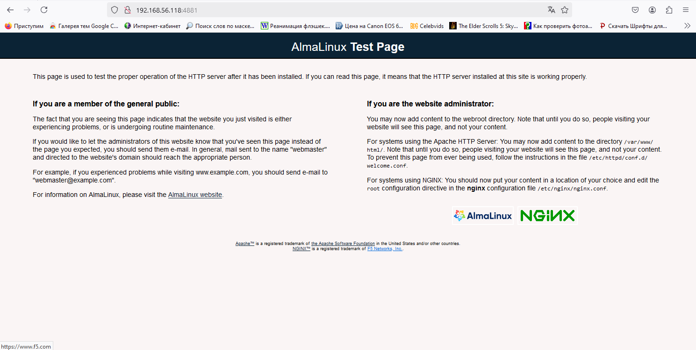

# Практика c SELinux

## Цель домашнего задания  
Диагностировать проблемы и модифицировать политики SELinux для корректной работы приложений, если  
это требуется.

### Описание домашнего задания  

1. Запустить Nginx на нестандартном порту 3-мя разными способами:  
переключатели setsebool;  
добавление нестандартного порта в имеющийся тип;  
формирование и установка модуля SELinux.  
 

2. Обеспечить работоспособность приложения при включенном selinux.  
развернуть приложенный стенд https://github.com/Nickmob/vagrant_selinux_dns_problems;   
выяснить причину неработоспособности механизма обновления зоны (см. README);  
предложить решение (или решения) для данной проблемы;  
выбрать одно из решений для реализации, предварительно обосновав выбор;  
реализовать выбранное решение и продемонстрировать его работоспособность.  

# Выполнение:  

# 1. Создаю виртуальную машину  

Код стенда взял из репозитория: https://github.com/Nickmob/vagrant_selinux  

Результатом выполнения команды vagrant up создается виртуальная машина с установленным nginx, который работает на порту TCP 4881.  
Порт TCP 4881 уже проброшен до хоста. SELinux включен.  
Во время развёртывания стенда попытка запустить nginx завершится с ошибкой:  

```shell

    selinux: Job for nginx.service failed because the control process exited with error code.
    selinux: See "systemctl status nginx.service" and "journalctl -xeu nginx.service" for details.
    selinux: × nginx.service - The nginx HTTP and reverse proxy server
    selinux:      Loaded: loaded (/usr/lib/systemd/system/nginx.service; disabled; preset: disabled)
    selinux:      Active: failed (Result: exit-code) since Fri 2025-01-03 09:00:41 UTC; 139ms ago
    selinux:     Process: 2071 ExecStartPre=/usr/bin/rm -f /run/nginx.pid (code=exited, status=0/SUCCESS)
    selinux:     Process: 2072 ExecStartPre=/usr/sbin/nginx -t (code=exited, status=1/FAILURE)
    selinux:         CPU: 85ms
    selinux:
    selinux: Jan 03 09:00:41 selinux systemd[1]: Starting The nginx HTTP and reverse proxy server...
    selinux: Jan 03 09:00:41 selinux nginx[2072]: nginx: the configuration file /etc/nginx/nginx.conf syntax is ok
    selinux: Jan 03 09:00:41 selinux nginx[2072]: nginx: [emerg] bind() to 0.0.0.0:4881 failed (13: Permission denied)
    selinux: Jan 03 09:00:41 selinux nginx[2072]: nginx: configuration file /etc/nginx/nginx.conf test failed
    selinux: Jan 03 09:00:41 selinux systemd[1]: nginx.service: Control process exited, code=exited, status=1/FAILURE
    selinux: Jan 03 09:00:41 selinux systemd[1]: nginx.service: Failed with result 'exit-code'.
    selinux: Jan 03 09:00:41 selinux systemd[1]: Failed to start The nginx HTTP and reverse proxy server.

```

## Данная ошибка появляется из-за того, что SELinux блокирует работу nginx на нестандартном порту.  
Захожу на сервер: vagrant ssh  
Дальнейшие действия выполняю от пользователя root. Перехожу в root пользователя: sudo -i  

# 2. Запуск nginx на нестандартном порту 3-мя разными способами  

## Для начала убедился, что в ОС отключен файервол: systemctl status firewalld  

```shell  

[root@selinux ~]# systemctl status firewalld
○ firewalld.service - firewalld - dynamic firewall daemon
     Loaded: loaded (/usr/lib/systemd/system/firewalld.service; disabled; preset: enabled)
     Active: inactive (dead)
       Docs: man:firewalld(1)

```

## Также проверил, что конфигурация nginx настроена без ошибок: nginx -t  

```shell

[root@selinux ~]# nginx -t
nginx: the configuration file /etc/nginx/nginx.conf syntax is ok
nginx: configuration file /etc/nginx/nginx.conf test is successful  

```  

## Далее проверил режим работы SELinux: getenforce  

```shell

[root@selinux ~]# getenforce
Enforcing  

```  

## Отображается режим Enforcing. Данный режим означает, что SELinux будет блокировать запрещенную активность.  

### Разрешаю в SELinux работу nginx на порту TCP 4881 c помощью переключателей setsebool  

#### Нахожу в логах (/var/log/audit/audit.log) информацию о блокировании порта  

```shell

grep  1735894841.735:407 /var/log/audit/audit.log | audit2why
type=AVC msg=audit(1735894841.735:407): avc:  denied  { name_bind } for  pid=2072 comm="nginx" src=4881 scontext=system_u:system_r:httpd_t:s0 tcontext=system_u:object_r:unreserved_port_t:s0 tclass=tcp_socket permissive=0

        Was caused by:
        The boolean nis_enabled was set incorrectly.
        Description:
        Allow nis to enabled

        Allow access by executing:
        # setsebool -P nis_enabled 1  

```  

### Утилита audit2why покажет почему трафик блокируется. Исходя из вывода утилиты, видно, что нужно поменять параметр nis_enabled.  
Включаю параметр nis_enabled и перезапускаю nginx: setsebool -P nis_enabled on  

```shell

[root@selinux ~]# setsebool -P nis_enabled on
 [root@selinux ~]# systemctl restart nginx
[root@selinux ~]# systemctl status nginx
● nginx.service - The nginx HTTP and reverse proxy server
     Loaded: loaded (/usr/lib/systemd/system/nginx.service; disabled; preset: disabled)
     Active: active (running) since Fri 2025-01-03 11:15:13 UTC; 9s ago
    Process: 2315 ExecStartPre=/usr/bin/rm -f /run/nginx.pid (code=exited, status=0/SUCCESS)
    Process: 2316 ExecStartPre=/usr/sbin/nginx -t (code=exited, status=0/SUCCESS)
    Process: 2317 ExecStart=/usr/sbin/nginx (code=exited, status=0/SUCCESS)
   Main PID: 2318 (nginx)
      Tasks: 3 (limit: 11997)
     Memory: 2.9M
        CPU: 123ms
     CGroup: /system.slice/nginx.service
             ├─2318 "nginx: master process /usr/sbin/nginx"
             ├─2319 "nginx: worker process"
             └─2320 "nginx: worker process"

Jan 03 11:15:13 selinux systemd[1]: Starting The nginx HTTP and reverse proxy server...
Jan 03 11:15:13 selinux nginx[2316]: nginx: the configuration file /etc/nginx/nginx.conf syntax is ok
Jan 03 11:15:13 selinux nginx[2316]: nginx: configuration file /etc/nginx/nginx.conf test is successful
Jan 03 11:15:13 selinux systemd[1]: Started The nginx HTTP and reverse proxy server. 

```  

### Также можно проверить работу nginx curl запросом в консоли на хосте по адресу http://127.0.0.1:4881  

```shell

[root@selinux ~]# curl http://127.0.0.1:4881
<!DOCTYPE html PUBLIC "-//W3C//DTD XHTML 1.1//EN" "http://www.w3.org/TR/xhtml11/DTD/xhtml11.dtd">

<html xmlns="http://www.w3.org/1999/xhtml" xml:lang="en">
        <head>
                <title>Test Page for the HTTP Server on AlmaLinux</title>
                <meta http-equiv="Content-Type" content="text/html; charset=UTF-8" />
                <style type="text/css">
                        /*<![CDATA[*/
                        body {
                                background-color: #FAF5F5;
                                color: #000;
                                font-size: 0.9em;
                                font-family: sans-serif,helvetica;
                                margin: 0;
                                padding: 0;
                        }
                        :link {
                                color: #0B2335;;
                        }
                        :visited {
                                color: #0B2335;;
                        }
                        a:hover {
                                color: #0069DA;
                        }
                        h1 {
                                text-align: center;
                                margin: 0;
                                padding: 0.6em 2em 0.4em;
                                background-color: #0B2335;
                                color: #fff;
                                font-weight: normal;
                                font-size: 1.75em;
                                border-bottom: 2px solid #000;
                        }
                        h1 strong {
                                font-weight: bold;
                        }
                        h2 {
                                font-size: 1.1em;
                                font-weight: bold;
                        }
                        hr {
                                display: none;
                        }
                        .content {
                                padding: 1em 5em;
                        }
                        .content-columns {
                                /* Setting relative positioning allows for
                                absolute positioning for sub-classes */
                                position: relative;
                                padding-top: 1em;
                        }
                        .content-column-left {
                                /* Value for IE/Win; will be overwritten for other browsers */
                                width: 47%;
                                padding-right: 3%;
                                float: left;
                                padding-bottom: 2em;
                        }
                        .content-column-left hr {
                                display: none;
                        }
                        .content-column-right {
                                /* Values for IE/Win; will be overwritten for other browsers */
                                width: 47%;
                                padding-left: 3%;
                                float: left;
                                padding-bottom: 2em;
                        }
                        .content-columns>.content-column-left, .content-columns>.content-column-right {
                                /* Non-IE/Win */
                        }
                        .logos {
                                text-align: center;
                                margin-top: 2em;
                        }
                        img {
                                border: 2px solid #fff;
                                padding: 2px;
                                margin: 2px;
                        }
                        a:hover img {
                                border: 2px solid #f50;
                        }
                        .footer {
                                clear: both;
                                text-align: center;
                                font-size: xx-small;
                        }
                        /*]]>*/
                </style>
        </head>

        <body>
                <h1>AlmaLinux <strong>Test Page</strong></h1>

                <div class="content">
                        <div class="content-middle">
                                <p>This page is used to test the proper operation of the HTTP server after it has been installed. If you can read this page, it means that the HTTP server installed at this site is working properly.</p>
                        </div>
                        <hr />

                        <div class="content-columns">
                                <div class="content-column-left">
                                        <h2>If you are a member of the general public:</h2>

                                        <p>The fact that you are seeing this page indicates that the website you just visited is either experiencing problems, or is undergoing routine maintenance.</p>

                                        <p>If you would like to let the administrators of this website know that you've seen this page instead of the page you expected, you should send them e-mail. In general, mail sent to the name "webmaster" and directed to the website's domain should reach the appropriate person.</p>

                                        <p>For example, if you experienced problems while visiting www.example.com, you should send e-mail to "webmaster@example.com".</p>

                                        <p>For information on AlmaLinux, please visit the <a href="http://www.almalinux.org/">AlmaLinux website</a>.</p>
                                        <hr />
                                </div>

                                <div class="content-column-right">
                                        <h2>If you are the website administrator:</h2>

                                        <p>You may now add content to the webroot directory. Note
                                        that until you do so, people visiting your website will see
                                        this page, and not your content.</p>

                                        <p>For systems using the Apache HTTP Server:
                                        You may now add content to the directory <tt>/var/www/html/</tt>. Note that until you do so, people visiting your website will see this page, and not your content. To prevent this page from ever being used, follow the instructions in the file <tt>/etc/httpd/conf.d/welcome.conf</tt>.</p>

                                        <p>For systems using NGINX:
                                        You should now put your content in a location of your
                                        choice and edit the <code>root</code> configuration directive
                                        in the <strong>nginx</strong> configuration file
                                        <code>/etc/nginx/nginx.conf</code>.</p>

                                        <div class="logos">
                                                <a href="http://www.almalinux.org"></a>
                                                
                                        </div>
                                </div>
                        </div>
                </div>
                <div class="footer">
                        <a href="https://apache.org">Apache&trade;</a> is a registered trademark of <a href="https://apache.org">the Apache Software Foundation</a> in the United States and/or other countries.<br />
                        <a href="https://nginx.com">NGINX&trade;</a> is a registered trademark of <a href="https://www.f5.com">F5 Networks, Inc.</a>.
                </div>
        </body>
</html>  

```  

### Проверить статус параметра можно с помощью команды: getsebool -a | grep nis_enabled  

```shell

[root@selinux ~]# getsebool -a | grep nis_enabled
nis_enabled --> on  

```  

## Возвращаю запрет работы nginx на порту 4881 обратно. Для этого отключаю nis_enabled: setsebool -P nis_enabled off   
После отключения nis_enabled служба nginx снова не запустится.  

```shell

[root@selinux ~]# setsebool -P nis_enabled off  

[root@selinux ~]# systemctl status nginx
○ nginx.service - The nginx HTTP and reverse proxy server
     Loaded: loaded (/usr/lib/systemd/system/nginx.service; disabled; preset: disabled)
     Active: inactive (dead)

```   

### Теперь в SELinux разрешу работу nginx на порту TCP 4881 c помощью добавления нестандартного порта в имеющийся тип:   

#### Поиск имеющегося типа, для http трафика: semanage port -l | grep http   

```shell

[root@selinux ~]# semanage port -l | grep http
http_cache_port_t              tcp      8080, 8118, 8123, 10001-10010
http_cache_port_t              udp      3130
http_port_t                    tcp      80, 81, 443, 488, 8008, 8009, 8443, 9000
pegasus_http_port_t            tcp      5988
pegasus_https_port_t           tcp      5989

```   

#### Добавил порт 4881 в тип http_port_t: semanage port -a -t http_port_t -p tcp 4881    

```shell

[root@selinux ~]# semanage port -a -t http_port_t -p tcp 4881
[root@selinux ~]# semanage port -l | grep  http_port_t
http_port_t                    tcp      4881, 80, 81, 443, 488, 8008, 8009, 8443, 9000
pegasus_http_port_t            tcp      5988

```   

#### Теперь перезапускаю службу nginx и проверяю её работу: systemctl restart nginx   


```shell

[root@selinux ~]# systemctl restart nginx
[root@selinux ~]# systemctl status nginx
● nginx.service - The nginx HTTP and reverse proxy server
     Loaded: loaded (/usr/lib/systemd/system/nginx.service; disabled; preset: disabled)
     Active: active (running) since Thu 2025-01-09 11:10:07 UTC; 9s ago
    Process: 1969 ExecStartPre=/usr/bin/rm -f /run/nginx.pid (code=exited, status=0/SUCCESS)
    Process: 1970 ExecStartPre=/usr/sbin/nginx -t (code=exited, status=0/SUCCESS)
    Process: 1971 ExecStart=/usr/sbin/nginx (code=exited, status=0/SUCCESS)
   Main PID: 1972 (nginx)
      Tasks: 3 (limit: 11997)
     Memory: 4.2M
        CPU: 146ms
     CGroup: /system.slice/nginx.service
             ├─1972 "nginx: master process /usr/sbin/nginx"
             ├─1973 "nginx: worker process"
             └─1974 "nginx: worker process"

Jan 09 11:10:07 selinux systemd[1]: Starting The nginx HTTP and reverse proxy server...
Jan 09 11:10:07 selinux nginx[1970]: nginx: the configuration file /etc/nginx/nginx.conf syntax is ok
Jan 09 11:10:07 selinux nginx[1970]: nginx: configuration file /etc/nginx/nginx.conf test is successful
Jan 09 11:10:07 selinux systemd[1]: Started The nginx HTTP and reverse proxy server.

```   

#### Также можно проверить работу nginx из браузера. В моем случае http://192.168.56.118:4881   

  




#### Удалить нестандартный порт можно с помощью команды: semanage port -d -t http_port_t -p tcp 4881   

```shell

[root@selinux ~]# semanage port -d -t http_port_t -p tcp 4881
[root@selinux ~]# semanage port -l | grep  http_port_t
http_port_t                    tcp      80, 81, 443, 488, 8008, 8009, 8443, 9000
pegasus_http_port_t            tcp      5988
[root@selinux ~]# systemctl restart nginx
Job for nginx.service failed because the control process exited with error code.
See "systemctl status nginx.service" and "journalctl -xeu nginx.service" for details.   
[root@selinux ~]# systemctl status nginx
× nginx.service - The nginx HTTP and reverse proxy server
     Loaded: loaded (/usr/lib/systemd/system/nginx.service; disabled; preset: disabled)
     Active: failed (Result: exit-code) since Thu 2025-01-09 11:28:52 UTC; 33s ago
   Duration: 18min 44.234s
    Process: 1990 ExecStartPre=/usr/bin/rm -f /run/nginx.pid (code=exited, status=0/SUCCESS)
    Process: 1992 ExecStartPre=/usr/sbin/nginx -t (code=exited, status=1/FAILURE)
        CPU: 145ms

Jan 09 11:28:52 selinux systemd[1]: Starting The nginx HTTP and reverse proxy server...
Jan 09 11:28:52 selinux nginx[1992]: nginx: the configuration file /etc/nginx/nginx.conf syntax is ok
Jan 09 11:28:52 selinux nginx[1992]: nginx: [emerg] bind() to 0.0.0.0:4881 failed (13: Permission denied)
Jan 09 11:28:52 selinux nginx[1992]: nginx: configuration file /etc/nginx/nginx.conf test failed
Jan 09 11:28:52 selinux systemd[1]: nginx.service: Control process exited, code=exited, status=1/FAILURE
Jan 09 11:28:52 selinux systemd[1]: nginx.service: Failed with result 'exit-code'.
Jan 09 11:28:52 selinux systemd[1]: Failed to start The nginx HTTP and reverse proxy server.

```   


### Разрешаю в SELinux работу nginx на порту TCP 4881 c помощью формирования и установки модуля SELinux:   

#### Попробую снова запустить Nginx: systemctl start nginx

```shell

[root@selinux ~]# systemctl start nginx
Job for nginx.service failed because the control process exited with error code.
See "systemctl status nginx.service" and "journalctl -xeu nginx.service" for details.

```   

#### Nginx не запустится, так как SELinux продолжает его блокировать. Посмотрел логи SELinux, которые относятся к Nginx:


```shell
...
type=SYSCALL msg=audit(1736422623.819:369): arch=c000003e syscall=49 success=no exit=-13 a0=6 a1=560c1efee6b0 a2=10 a3=7ffeb31ca720 items=0 ppid=1 pid=2013 auid=4294967295 uid=0 gid=0 euid=0 suid=0 fsuid=0 egid=0 sgid=0 fsgid=0 tty=(none) ses=4294967295 comm="nginx" exe="/usr/sbin/nginx" subj=system_u:system_r:httpd_t:s0 key=(null)ARCH=x86_64 SYSCALL=bind AUID="unset" UID="root" GID="root" EUID="root" SUID="root" FSUID="root" EGID="root" SGID="root" FSGID="root"
type=SERVICE_START msg=audit(1736422623.826:370): pid=1 uid=0 auid=4294967295 ses=4294967295 subj=system_u:system_r:init_t:s0 msg='unit=nginx comm="systemd" exe="/usr/lib/systemd/systemd" hostname=? addr=? terminal=? res=failed'UID="root" AUID="unset"

```   

#### Воспользовался утилитой audit2allow для того, чтобы на основе логов SELinux сделать модуль, разрешающий работу nginx на нестандартном порту:   
*grep nginx /var/log/audit/audit.log | audit2allow -M nginx*

```shell

[root@selinux ~]# grep nginx /var/log/audit/audit.log | audit2allow -M nginx
******************** IMPORTANT ***********************
To make this policy package active, execute:

semodule -i nginx.pp

```    

#### Audit2allow сформировал модуль, и сообщил команду, с помощью которой можно применить данный модуль: semodule -i nginx.pp


```shell

[root@selinux ~]# semodule -i nginx.pp

```   

#### Попробую снова запустить nginx: systemctl start nginx

```shell

[root@selinux ~]# systemctl start nginx
[root@selinux ~]# systemctl status nginx
● nginx.service - The nginx HTTP and reverse proxy server
     Loaded: loaded (/usr/lib/systemd/system/nginx.service; disabled; preset: disabled)
     Active: active (running) since Thu 2025-01-09 11:59:44 UTC; 10s ago
    Process: 2063 ExecStartPre=/usr/bin/rm -f /run/nginx.pid (code=exited, status=0/SUCCESS)
    Process: 2064 ExecStartPre=/usr/sbin/nginx -t (code=exited, status=0/SUCCESS)
    Process: 2065 ExecStart=/usr/sbin/nginx (code=exited, status=0/SUCCESS)
   Main PID: 2066 (nginx)
      Tasks: 3 (limit: 11997)
     Memory: 2.9M
        CPU: 152ms
     CGroup: /system.slice/nginx.service
             ├─2066 "nginx: master process /usr/sbin/nginx"
             ├─2067 "nginx: worker process"
             └─2068 "nginx: worker process"

Jan 09 11:59:44 selinux systemd[1]: Starting The nginx HTTP and reverse proxy server...
Jan 09 11:59:44 selinux nginx[2064]: nginx: the configuration file /etc/nginx/nginx.conf syntax is ok
Jan 09 11:59:44 selinux nginx[2064]: nginx: configuration file /etc/nginx/nginx.conf test is successful
Jan 09 11:59:44 selinux systemd[1]: Started The nginx HTTP and reverse proxy server.

```   

#### После добавления модуля nginx запустился без ошибок. При использовании модуля изменения сохранятся после перезагрузки. 
#### Просмотр всех установленных модулей: semodule -l
#### Для удаления модуля воспользуемся командой: semodule -r nginx

```shell

[root@selinux ~]# semodule -r nginx
libsemanage.semanage_direct_remove_key: Removing last nginx module (no other nginx module exists at another priority).

```   
_______________________________________________________________________________________________________________________

# 2. Обеспечение работоспособности приложения при включенном SELinux   

## Создал и перешел в каталог со стендом: cd /selinux/dns-problem


### Развернул 2 ВМ с помощью vagrant: vagrant up   

#### После того, как стенд развернулся, проверил ВМ с помощью команды: vagrant status

```shell

# vagrant status
Current machine states:

ns01                      running (virtualbox)
client                    running (virtualbox)

This environment represents multiple VMs. The VMs are all listed
above with their current state. For more information about a specific
VM, run `vagrant status NAME`.

```   

#### Подключился к клиенту: vagrant ssh client   

#### Попробую внести изменения в зону: nsupdate -k /etc/named.zonetransfer.key   


```shell

[vagrant@client ~]$ nsupdate -k /etc/named.zonetransfer.key
> server 192.168.50.10
> zone ddns.lab
> update add www.ddns.lab. 60 A 192.168.50.15
> send
update failed: SERVFAIL
> quit

```   

#### Изменения внести не получилось. Далее смотрю логи SELinux, чтобы понять в чём может быть проблема.  

#### Для этого воспользуемся утилитой audit2why:   


```shell

[vagrant@client ~]$ sudo -i
[root@client ~]# cat /var/log/audit/audit.log | audit2why

```   

#### На клиенте отсутствуют ошибки.   


#### Не закрывая сессию на клиенте, подключился к серверу ns01 и проверил логи SELinux:
   
```shell

[vagrant@ns01 ~]$ sudo -i
[root@ns01 ~]# cat /var/log/audit/audit.log | audit2why
type=AVC msg=audit(1736507337.558:1726): avc:  denied  { write } for  pid=7182 comm="isc-net-0001" name="dynamic" dev="sda4" ino=34084226 scontext=system_u:system_r:named_t:s0 tcontext=unconfined_u:object_r:named_conf_t:s0 tclass=dir permissive=0

        Was caused by:
                Missing type enforcement (TE) allow rule.

                You can use audit2allow to generate a loadable module to allow this access.

```   

#### В логах видно, что ошибка в контексте безопасности. Целевой контекст named_conf_t.   

#### Для сравнения посмотрел существующую зону (localhost) и её контекст:


```shell

[root@ns01 ~]# ls -alZ /var/named/named.localhost
-rw-r-----. 1 root named system_u:object_r:named_zone_t:s0 152 Oct  3 05:26 /var/named/named.localhost

```   

#### У конфигов в /etc/named вместо типа named_zone_t используется тип named_conf_t.   

#### Проверил данную проблему в каталоге /etc/named:  

```shell

[root@ns01 ~]# ls -laZ /etc/named
total 28
drw-rwx---.  3 root named system_u:object_r:named_conf_t:s0      121 Jan 10 10:32 .
drwxr-xr-x. 85 root root  system_u:object_r:etc_t:s0            8192 Jan 10 10:32 ..
drw-rwx---.  2 root named unconfined_u:object_r:named_conf_t:s0   56 Jan 10 10:32 dynamic
-rw-rw----.  1 root named system_u:object_r:named_conf_t:s0      784 Jan 10 10:32 named.50.168.192.rev
-rw-rw----.  1 root named system_u:object_r:named_conf_t:s0      610 Jan 10 10:32 named.dns.lab
-rw-rw----.  1 root named system_u:object_r:named_conf_t:s0      609 Jan 10 10:32 named.dns.lab.view1
-rw-rw----.  1 root named system_u:object_r:named_conf_t:s0      657 Jan 10 10:32 named.newdns.lab

```   

#### Тут вижу, что контекст безопасности неправильный. 
#### Проблема заключается в том, что конфигурационные файлы лежат в другом каталоге. 
#### Посмотреть в каком каталоге должны лежать, файлы, чтобы на них распространялись правильные политики SELinux можно с помощью команды:   
*sudo semanage fcontext -l | grep named*   

```shell

[root@ns01 ~]# sudo semanage fcontext -l | grep named   
...   
/etc/rndc.*                                        regular file       system_u:object_r:named_conf_t:s0
/var/named(/.*)?                                   all files          system_u:object_r:named_zone_t:s0   
...
```   
#### Изменю тип контекста безопасности для каталога /etc/named:   
*sudo chcon -R -t named_zone_t /etc/named*   

```shell

[root@ns01 ~]# sudo chcon -R -t named_zone_t /etc/named
[root@ns01 ~]# ls -laZ /etc/named
total 28
drw-rwx---.  3 root named system_u:object_r:named_zone_t:s0      121 Jan 10 10:32 .
drwxr-xr-x. 85 root root  system_u:object_r:etc_t:s0            8192 Jan 10 10:32 ..
drw-rwx---.  2 root named unconfined_u:object_r:named_zone_t:s0   56 Jan 10 10:32 dynamic
-rw-rw----.  1 root named system_u:object_r:named_zone_t:s0      784 Jan 10 10:32 named.50.168.192.rev
-rw-rw----.  1 root named system_u:object_r:named_zone_t:s0      610 Jan 10 10:32 named.dns.lab
-rw-rw----.  1 root named system_u:object_r:named_zone_t:s0      609 Jan 10 10:32 named.dns.lab.view1
-rw-rw----.  1 root named system_u:object_r:named_zone_t:s0      657 Jan 10 10:32 named.newdns.lab   

```   

#### Попробую снова внести изменения с клиента:   

```shell

[vagrant@client ~]$ nsupdate -k /etc/named.zonetransfer.key
> server 192.168.50.10
> zone ddns.lab
> update add www.ddns.lab. 60 A 192.168.50.15
> send
> quit
[vagrant@client ~]$ dig www.ddns.lab

; <<>> DiG 9.16.23-RH <<>> www.ddns.lab
;; global options: +cmd
;; Got answer:
;; ->>HEADER<<- opcode: QUERY, status: NOERROR, id: 54979
;; flags: qr aa rd ra; QUERY: 1, ANSWER: 1, AUTHORITY: 0, ADDITIONAL: 1

;; OPT PSEUDOSECTION:
; EDNS: version: 0, flags:; udp: 1232
; COOKIE: 98c25ffaaf152bcc01000000678109743b1bdc45c4f14383 (good)
;; QUESTION SECTION:
;www.ddns.lab.                  IN      A

;; ANSWER SECTION:
www.ddns.lab.           60      IN      A       192.168.50.15

;; Query time: 8 msec
;; SERVER: 192.168.50.10#53(192.168.50.10)
;; WHEN: Fri Jan 10 11:50:12 UTC 2025
;; MSG SIZE  rcvd: 85

```   

#### Изменения применились. Попробую перезагрузить хосты и ещё раз сделать запрос с помощью dig:   

```shell

[vagrant@client ~]$ dig @192.168.50.10 www.ddns.lab

; <<>> DiG 9.16.23-RH <<>> @192.168.50.10 www.ddns.lab
; (1 server found)
;; global options: +cmd
;; Got answer:
;; ->>HEADER<<- opcode: QUERY, status: NOERROR, id: 40412
;; flags: qr aa rd ra; QUERY: 1, ANSWER: 1, AUTHORITY: 0, ADDITIONAL: 1

;; OPT PSEUDOSECTION:
; EDNS: version: 0, flags:; udp: 1232
; COOKIE: d8f4aa8821065b0f0100000067810f43dcb5ded95238ce85 (good)
;; QUESTION SECTION:
;www.ddns.lab.                  IN      A

;; ANSWER SECTION:
www.ddns.lab.           60      IN      A       192.168.50.15

;; Query time: 19 msec
;; SERVER: 192.168.50.10#53(192.168.50.10)
;; WHEN: Fri Jan 10 12:14:59 UTC 2025
;; MSG SIZE  rcvd: 85

```   

#### Всё правильно. После перезагрузки настройки сохранились.   

#### Важно, что не понадобилось добавлять новые правила в политику для назначения этого контекста в каталоге.   
#### Значит, что при перемаркировке файлов контекст вернётся на тот, который прописан в файле политики.   
#### Для того, чтобы вернуть правила обратно, можно ввести команду: *restorecon -v -R /etc/named*   

```shell

[root@ns01 ~]# restorecon -v -R /etc/named
Relabeled /etc/named from system_u:object_r:named_zone_t:s0 to system_u:object_r:named_conf_t:s0
Relabeled /etc/named/named.dns.lab.view1 from system_u:object_r:named_zone_t:s0 to system_u:object_r:named_conf_t:s0
Relabeled /etc/named/named.dns.lab from system_u:object_r:named_zone_t:s0 to system_u:object_r:named_conf_t:s0
Relabeled /etc/named/dynamic from unconfined_u:object_r:named_zone_t:s0 to unconfined_u:object_r:named_conf_t:s0
Relabeled /etc/named/dynamic/named.ddns.lab from system_u:object_r:named_zone_t:s0 to system_u:object_r:named_conf_t:s0
Relabeled /etc/named/dynamic/named.ddns.lab.view1 from system_u:object_r:named_zone_t:s0 to system_u:object_r:named_conf_t:s0
Relabeled /etc/named/dynamic/named.ddns.lab.view1.jnl from system_u:object_r:named_zone_t:s0 to system_u:object_r:named_conf_t:s0
Relabeled /etc/named/named.newdns.lab from system_u:object_r:named_zone_t:s0 to system_u:object_r:named_conf_t:s0
Relabeled /etc/named/named.50.168.192.rev from system_u:object_r:named_zone_t:s0 to system_u:object_r:named_conf_t:s0

```   

______________   
end
